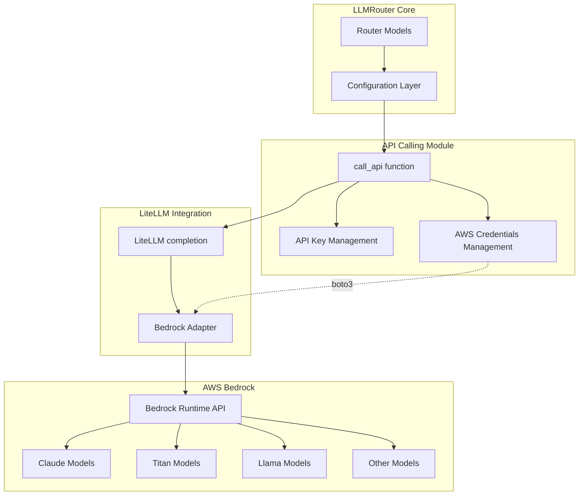

# Design Document: AWS Bedrock Support

## Overview

This design document describes the integration of AWS Bedrock as a supported LLM provider in LLMRouter. The integration will enable routing to Bedrock-hosted foundation models (Claude, Titan, Llama, Mistral, etc.) alongside existing providers (NVIDIA, OpenAI, Anthropic).

The design follows LLMRouter's existing provider integration patterns, leveraging LiteLLM's Bedrock support while adding custom handling for AWS-specific authentication, regional configuration, and model-specific request formatting. The implementation will be backward compatible with existing configurations and workflows.

### Key Design Principles

1. **Minimal Code Changes**: Leverage LiteLLM's existing Bedrock support rather than implementing from scratch
2. **Consistent Interface**: Maintain the same API calling interface used by other providers
3. **Flexible Authentication**: Support multiple AWS credential mechanisms (env vars, credential files, IAM roles)
4. **Regional Flexibility**: Allow per-model region configuration for optimal latency and model availability
5. **Backward Compatibility**: Ensure existing configurations continue to work without modification

## Architecture

### High-Level Architecture



### Component Interaction Flow

1. **Router Selection**: Router selects a Bedrock model based on query characteristics
2. **Configuration Lookup**: System retrieves model configuration from LLM_Candidate_JSON
3. **Credential Resolution**: AWS credentials are resolved via boto3's credential chain
4. **API Call Preparation**: Request is formatted with model-specific parameters
5. **LiteLLM Invocation**: LiteLLM's Bedrock adapter is called with formatted request
6. **Bedrock API Call**: Boto3 invokes Bedrock Runtime API with proper authentication
7. **Response Processing**: Response is parsed and token usage is extracted
8. **Result Return**: Formatted result is returned to the router

## Components and Interfaces

### 1. AWS Credentials Management

**Purpose**: Handle AWS credential resolution and validation for Bedrock API calls.

**Implementation Approach**:
- Use boto3's default credential chain (env vars → credential files → IAM roles)
- No explicit credential management needed in LLMRouter code
- LiteLLM will automatically use boto3's credential resolution

**Credential Resolution Order** (boto3 default):
1. Environment variables: `AWS_ACCESS_KEY_ID`, `AWS_SECRET_ACCESS_KEY`, `AWS_SESSION_TOKEN`
2. AWS credential file: `~/.aws/credentials` (default profile or specified profile)
3. AWS config file: `~/.aws/config`
4. IAM role (when running on EC2, ECS, Lambda, etc.)

**Configuration Options**:
```python
# Option 1: Environment variables (recommended for development)
export AWS_ACCESS_KEY_ID="your-access-key"
export AWS_SECRET_ACCESS_KEY="your-secret-key"
export AWS_DEFAULT_REGION="us-east-1"

# Option 2: AWS credential file
# ~/.aws/credentials
[default]
aws_access_key_id = your-access-key
aws_secret_access_key = your-secret-key

# ~/.aws/config
[default]
region = us-east-1

# Option 3: IAM role (automatic on AWS infrastructure)
# No configuration needed
```

### 2. LLM Candidate JSON Configuration

**Purpose**: Define Bedrock models with their metadata, pricing, and configuration.

**Schema Extension**:
```json
{
  "claude-3-sonnet": {
    "size": "Unknown",
    "feature": "Claude 3 Sonnet by Anthropic via AWS Bedrock - balanced performance and speed",
    "input_price": 3.0,
    "output_price": 15.0,
    "model": "anthropic.claude-3-sonnet-20240229-v1:0",
    "service": "Bedrock",
    "aws_region": "us-east-1"
  },
  "titan-text-express": {
    "size": "Unknown",
    "feature": "Amazon Titan Text Express - fast and cost-effective text generation",
    "input_price": 0.2,
    "output_price": 0.6,
    "model": "amazon.titan-text-express-v1",
    "service": "Bedrock",
    "aws_region": "us-west-2"
  }
}
```

**Field Descriptions**:
- `model`: Bedrock Model ID (required) - must match exact Bedrock model identifier
- `service`: Must be "Bedrock" or "AWS" (case-insensitive matching)
- `aws_region`: AWS region for this model (optional, defaults to AWS_DEFAULT_REGION)
- `size`: Model parameter count (use "Unknown" if not publicly disclosed)
- `feature`: Human-readable description of model capabilities
- `input_price`: Cost per million input tokens (USD)
- `output_price`: Cost per million output tokens (USD)

**Note**: The `api_endpoint` field is not used for Bedrock models, as the endpoint is determined by the AWS region and service.

### 3. API Calling Module Modifications

**File**: `llmrouter/utils/api_calling.py`

**Current Implementation Analysis**:
- Uses LiteLLM's `completion()` function with OpenAI-compatible format
- Supports service-specific API key selection via dict format
- Handles round-robin load balancing across multiple API keys
- Formats model as `openai/{api_name}` for LiteLLM

**Required Changes**:

#### 3.1 Bedrock Model Detection

Add logic to detect when a model uses Bedrock service:

```python
def _is_bedrock_model(service: Optional[str]) -> bool:
    """Check if the service is AWS Bedrock."""
    if not service:
        return False
    return service.lower() in ['bedrock', 'aws']
```

#### 3.2 Bedrock Model Formatting

Modify model formatting for LiteLLM:

```python
# Current format for OpenAI-compatible APIs:
model_for_litellm = f"openai/{req['api_name']}"

# New format for Bedrock:
if _is_bedrock_model(req.get('service')):
    # LiteLLM expects format: bedrock/{model_id}
    model_for_litellm = f"bedrock/{req['api_name']}"
else:
    model_for_litellm = f"openai/{req['api_name']}"
```

#### 3.3 AWS Region Handling

Extract and pass AWS region to LiteLLM:

```python
# Extract AWS region from request (if specified)
aws_region = req.get('aws_region')

# Pass to LiteLLM completion call
if _is_bedrock_model(req.get('service')):
    # LiteLLM will use boto3's default region if not specified
    completion_kwargs = {
        'model': model_for_litellm,
        'messages': messages,
        'max_tokens': max_tokens,
        'temperature': temperature,
        'top_p': top_p,
        'timeout': timeout
    }
    
    # Add region if specified
    if aws_region:
        completion_kwargs['aws_region_name'] = aws_region
    
    response = completion(**completion_kwargs)
```

#### 3.4 API Key Handling for Bedrock

Bedrock doesn't use API keys in the same way as other providers. Instead, it uses AWS credentials:

```python
# For Bedrock, we don't need to pass api_key to LiteLLM
# LiteLLM will automatically use boto3's credential chain
if _is_bedrock_model(req.get('service')):
    # Don't pass api_key for Bedrock
    # LiteLLM will use boto3 credentials automatically
    response = completion(
        model=model_for_litellm,
        messages=messages,
        max_tokens=max_tokens,
        temperature=temperature,
        top_p=top_p,
        timeout=timeout,
        aws_region_name=aws_region  # Optional
    )
else:
    # Existing logic for other providers
    response = completion(
        model=model_for_litellm,
        messages=messages,
        api_key=selected_api_key,
        api_base=req['api_endpoint'],
        max_tokens=max_tokens,
        temperature=temperature,
        top_p=top_p,
        timeout=timeout
    )
```

### 4. Configuration File Updates

**Router Config YAML**: No changes needed - Bedrock models work with existing router configurations.

**OpenClaw Config YAML**: Add Bedrock models to the `llms` section:

```yaml
llms:
  claude-3-sonnet:
    provider: bedrock  # or 'aws'
    model: anthropic.claude-3-sonnet-20240229-v1:0
    description: "Claude 3 Sonnet via AWS Bedrock"
    max_tokens: 4096
    aws_region: us-east-1  # Optional
```

### 5. Data Generation Pipeline Integration

**File**: `llmrouter/data/api_calling_evaluation.py`

**Required Changes**: Minimal - the pipeline uses the same `call_api()` function, so Bedrock support will automatically work once the API calling module is updated.

**Considerations**:
- Bedrock models should be added to `default_llm.json` with proper pricing
- The embedding generation process will include Bedrock model metadata
- API calling will use AWS credentials instead of API keys

### 6. Error Handling and Validation

**Error Scenarios and Messages**:

1. **Missing boto3 dependency**:
```python
try:
    import boto3
except ImportError:
    raise ImportError(
        "AWS Bedrock support requires boto3. Install it with: pip install boto3"
    )
```

2. **Missing AWS credentials**:
```python
# LiteLLM will raise an error if credentials are not found
# We should catch and provide helpful message
try:
    response = completion(...)
except Exception as e:
    if "credentials" in str(e).lower():
        raise ValueError(
            "AWS credentials not found. Please configure credentials using one of:\n"
            "1. Environment variables: AWS_ACCESS_KEY_ID, AWS_SECRET_ACCESS_KEY\n"
            "2. AWS credential file: ~/.aws/credentials\n"
            "3. IAM role (when running on AWS infrastructure)\n"
            f"Original error: {e}"
        )
    raise
```

3. **Invalid model ID**:
```python
# LiteLLM will raise an error if model is not found
# Provide helpful message with common model IDs
try:
    response = completion(...)
except Exception as e:
    if "model" in str(e).lower() or "not found" in str(e).lower():
        raise ValueError(
            f"Bedrock model '{model_id}' not found or not accessible.\n"
            "Common model IDs:\n"
            "- anthropic.claude-3-sonnet-20240229-v1:0\n"
            "- anthropic.claude-3-haiku-20240307-v1:0\n"
            "- amazon.titan-text-express-v1\n"
            "- meta.llama3-70b-instruct-v1:0\n"
            f"Original error: {e}"
        )
    raise
```

4. **Region mismatch**:
```python
# LiteLLM will raise an error if model is not available in region
try:
    response = completion(...)
except Exception as e:
    if "region" in str(e).lower():
        raise ValueError(
            f"Model may not be available in region '{aws_region}'.\n"
            "Try a different region or check model availability at:\n"
            "https://docs.aws.amazon.com/bedrock/latest/userguide/models-regions.html\n"
            f"Original error: {e}"
        )
    raise
```

## Data Models

### Request Dictionary Schema

**Extended for Bedrock**:
```python
{
    "api_endpoint": str,           # Not used for Bedrock (optional)
    "query": str,                  # User query (required)
    "model_name": str,             # Display name (required)
    "api_name": str,               # Bedrock Model ID (required)
    "service": str,                # "Bedrock" or "AWS" (required)
    "aws_region": str,             # AWS region (optional)
    "system_prompt": str,          # System prompt (optional)
    "temperature": float,          # Sampling temperature (optional)
    "max_tokens": int,             # Max tokens to generate (optional)
    "top_p": float,                # Top-p sampling (optional)
}
```

### Response Dictionary Schema

**No changes needed** - existing schema works for Bedrock:
```python
{
    # Input fields (echoed back)
    "api_endpoint": str,
    "query": str,
    "model_name": str,
    "api_name": str,
    "service": str,
    
    # Output fields
    "response": str,               # Generated text
    "token_num": int,              # Total tokens used
    "prompt_tokens": int,          # Input tokens
    "completion_tokens": int,      # Output tokens
    "response_time": float,        # Time in seconds
    "error": str,                  # Error message (if failed)
}
```

### LLM Candidate Schema

**Bedrock-specific fields**:
```python
{
    "model": str,                  # Bedrock Model ID (required)
    "service": str,                # "Bedrock" or "AWS" (required)
    "aws_region": str,             # AWS region (optional)
    "size": str,                   # Parameter count or "Unknown"
    "feature": str,                # Model description
    "input_price": float,          # USD per million input tokens
    "output_price": float,         # USD per million output tokens
}
```

## Correctness Properties

*A property is a characteristic or behavior that should hold true across all valid executions of a system—essentially, a formal statement about what the system should do. Properties serve as the bridge between human-readable specifications and machine-verifiable correctness guarantees.*

### Property 1: Bedrock Service Recognition

*For any* LLM candidate configuration with service field set to "Bedrock" or "AWS" (case-insensitive), the system should recognize it as a valid Bedrock provider and accept the configuration without errors.

**Validates: Requirements 1.1, 2.1**

### Property 2: Bedrock Request Routing

*For any* API request with service "Bedrock" or "AWS", the system should format the model identifier as "bedrock/{model_id}" when calling LiteLLM, rather than "openai/{model_id}".

**Validates: Requirements 1.2, 3.1**

### Property 3: Configuration Schema Completeness

*For any* Bedrock model configuration containing the required fields (model, service, size, feature, input_price, output_price), the system should accept and store all fields correctly.

**Validates: Requirements 2.2, 6.1, 6.3, 6.4**

### Property 4: Regional Configuration

*For any* Bedrock model request that includes an aws_region field, the system should pass that region to LiteLLM via the aws_region_name parameter.

**Validates: Requirements 2.3, 4.4**

### Property 5: Response Parsing

*For any* successful Bedrock API call, the response should contain a non-empty response text field and the original request fields should be preserved in the response.

**Validates: Requirements 3.3**

### Property 6: Response Metadata

*For any* successful Bedrock API call, the response should include token_num, prompt_tokens, completion_tokens, and response_time fields with non-negative values.

**Validates: Requirements 3.5, 3.6**

### Property 7: System Prompt Passthrough

*For any* request that includes a system_prompt field, the system should include it in the messages array sent to LiteLLM with role "system".

**Validates: Requirements 5.3**

### Property 8: Inference Parameters

*For any* request that includes inference parameters (temperature, top_p, max_tokens), the system should pass those parameters to LiteLLM.

**Validates: Requirements 5.5**

### Property 9: Backward Compatibility

*For any* mixed configuration containing both Bedrock models and non-Bedrock models (NVIDIA, OpenAI, etc.), the system should successfully process requests for both types using the appropriate authentication and API calling logic, and return responses in the same format.

**Validates: Requirements 8.1, 8.5**

## Error Handling

### Error Scenarios and Handling Strategy

The Bedrock integration must handle various error conditions gracefully and provide actionable error messages to users.

#### 1. Missing boto3 Dependency

**Scenario**: User attempts to use Bedrock models without boto3 installed.

**Detection**: Import error when LiteLLM attempts to use boto3.

**Handling**: LiteLLM will raise an ImportError. We should catch this and provide a clear message:

```python
try:
    response = completion(...)
except ImportError as e:
    if "boto3" in str(e).lower():
        raise ImportError(
            "AWS Bedrock support requires boto3. Install it with:\n"
            "  pip install boto3\n"
            "Or install with LLMRouter:\n"
            "  pip install llmrouter-lib[bedrock]"
        ) from e
    raise
```

**User Action**: Install boto3 package.

#### 2. Missing AWS Credentials

**Scenario**: User attempts to use Bedrock models without configuring AWS credentials.

**Detection**: Authentication error from boto3/LiteLLM.

**Handling**: Catch credential-related exceptions and provide setup instructions:

```python
try:
    response = completion(...)
except Exception as e:
    error_msg = str(e).lower()
    if "credentials" in error_msg or "authentication" in error_msg or "access denied" in error_msg:
        raise ValueError(
            "AWS credentials not found or invalid. Configure credentials using one of:\n"
            "1. Environment variables:\n"
            "   export AWS_ACCESS_KEY_ID='your-key-id'\n"
            "   export AWS_SECRET_ACCESS_KEY='your-secret-key'\n"
            "   export AWS_DEFAULT_REGION='us-east-1'\n"
            "2. AWS credential file (~/.aws/credentials):\n"
            "   [default]\n"
            "   aws_access_key_id = your-key-id\n"
            "   aws_secret_access_key = your-secret-key\n"
            "3. IAM role (when running on AWS infrastructure)\n"
            f"\nOriginal error: {e}"
        ) from e
    raise
```

**User Action**: Configure AWS credentials using one of the supported methods.

#### 3. Invalid Model ID

**Scenario**: User specifies a Bedrock model ID that doesn't exist or isn't accessible.

**Detection**: Model not found error from Bedrock API.

**Handling**: Provide helpful message with common model IDs:

```python
try:
    response = completion(...)
except Exception as e:
    error_msg = str(e).lower()
    if "model" in error_msg or "not found" in error_msg or "does not exist" in error_msg:
        raise ValueError(
            f"Bedrock model '{model_id}' not found or not accessible.\n"
            "Common Bedrock model IDs:\n"
            "  Claude: anthropic.claude-3-sonnet-20240229-v1:0\n"
            "  Claude: anthropic.claude-3-haiku-20240307-v1:0\n"
            "  Titan: amazon.titan-text-express-v1\n"
            "  Llama: meta.llama3-70b-instruct-v1:0\n"
            "  Mistral: mistral.mistral-7b-instruct-v0:2\n"
            "Check model availability: https://docs.aws.amazon.com/bedrock/latest/userguide/models-supported.html\n"
            f"\nOriginal error: {e}"
        ) from e
    raise
```

**User Action**: Verify model ID and check model availability in their AWS region.

#### 4. Region Mismatch

**Scenario**: User attempts to use a model that's not available in the configured region.

**Detection**: Region-related error from Bedrock API.

**Handling**: Suggest checking model availability:

```python
try:
    response = completion(...)
except Exception as e:
    error_msg = str(e).lower()
    if "region" in error_msg or "not available" in error_msg:
        raise ValueError(
            f"Model may not be available in region '{aws_region}'.\n"
            "Try one of:\n"
            "1. Use a different region (add 'aws_region' field to model config)\n"
            "2. Check model availability: https://docs.aws.amazon.com/bedrock/latest/userguide/models-regions.html\n"
            "3. Request access to the model in AWS Bedrock console\n"
            f"\nOriginal error: {e}"
        ) from e
    raise
```

**User Action**: Check model availability in their region or switch regions.

#### 5. API Call Timeout

**Scenario**: Bedrock API call takes longer than the configured timeout.

**Detection**: Timeout exception from LiteLLM/boto3.

**Handling**: Suggest increasing timeout:

```python
try:
    response = completion(...)
except Exception as e:
    error_msg = str(e).lower()
    if "timeout" in error_msg or "timed out" in error_msg:
        raise TimeoutError(
            f"Bedrock API call timed out after {timeout} seconds.\n"
            "Try:\n"
            "1. Increase timeout parameter in call_api()\n"
            "2. Check network connectivity to AWS\n"
            "3. Try a different AWS region\n"
            f"\nOriginal error: {e}"
        ) from e
    raise
```

**User Action**: Increase timeout or check network connectivity.

#### 6. General API Errors

**Scenario**: Other Bedrock API errors (rate limiting, service errors, etc.).

**Detection**: Any other exception from LiteLLM/boto3.

**Handling**: Return error in response dict with original error message:

```python
except Exception as e:
    error_msg = str(e)
    end_time = time.time()
    
    result['response'] = f"Bedrock API Error: {error_msg[:200]}"
    result['token_num'] = 0
    result['prompt_tokens'] = 0
    result['completion_tokens'] = 0
    result['response_time'] = end_time - start_time
    result['error'] = error_msg
```

**User Action**: Check error message for specific issue (rate limits, permissions, etc.).

### Error Handling Principles

1. **Actionable Messages**: Every error message should tell the user what went wrong and how to fix it
2. **Preserve Original Error**: Always include the original error message for debugging
3. **Graceful Degradation**: Return error in response dict rather than crashing the entire batch
4. **Consistent Format**: Use the same error response format as other providers

## Testing Strategy

### Dual Testing Approach

The Bedrock integration will use both unit tests and property-based tests to ensure comprehensive coverage:

- **Unit tests**: Verify specific examples, edge cases, and error conditions
- **Property tests**: Verify universal properties across all inputs

Both testing approaches are complementary and necessary for comprehensive coverage. Unit tests catch concrete bugs in specific scenarios, while property tests verify general correctness across many randomly generated inputs.

### Property-Based Testing

**Library**: Use `hypothesis` for Python property-based testing.

**Configuration**: Each property test should run a minimum of 100 iterations to ensure thorough coverage through randomization.

**Test Tagging**: Each property test must reference its design document property using this format:
```python
# Feature: bedrock-support, Property 1: Bedrock Service Recognition
```

**Property Test Implementation**: Each correctness property from the design document must be implemented as a single property-based test.

### Unit Testing Focus

Unit tests should focus on:

1. **Specific Examples**: Test common Bedrock model configurations (Claude, Titan, Llama)
2. **Edge Cases**: Test empty strings, missing fields, invalid formats
3. **Error Conditions**: Test missing credentials, invalid model IDs, timeouts
4. **Integration Points**: Test interaction with LiteLLM and boto3

Avoid writing too many unit tests for scenarios that property tests already cover. Focus unit tests on concrete examples and integration points.

### Test Coverage Areas

#### 1. Configuration Validation Tests

**Property Tests**:
- Property 1: Service recognition with various case combinations
- Property 3: Configuration schema with random valid field values

**Unit Tests**:
- Example configurations for Claude, Titan, Llama models
- Missing required fields
- Invalid field types

#### 2. Request Formatting Tests

**Property Tests**:
- Property 2: Model identifier formatting for Bedrock vs non-Bedrock
- Property 4: Regional configuration passthrough
- Property 7: System prompt inclusion
- Property 8: Inference parameter passthrough

**Unit Tests**:
- Specific model ID formats
- Edge cases: empty system prompt, missing parameters

#### 3. Response Handling Tests

**Property Tests**:
- Property 5: Response parsing completeness
- Property 6: Response metadata presence and validity

**Unit Tests**:
- Specific response formats from different model families
- Error response handling

#### 4. Backward Compatibility Tests

**Property Tests**:
- Property 9: Mixed provider configurations

**Unit Tests**:
- Specific combinations: Bedrock + NVIDIA, Bedrock + OpenAI
- Existing test suites should pass with Bedrock models added

#### 5. Error Handling Tests

**Unit Tests** (error conditions are best tested with specific examples):
- Missing boto3 dependency (mock import failure)
- Missing AWS credentials (mock credential error)
- Invalid model ID (mock API error)
- Region mismatch (mock region error)
- API timeout (mock timeout)

### Test Data Generation

For property-based tests, generate random:
- Service names: "Bedrock", "AWS", "bedrock", "aws", "BEDROCK"
- Model IDs: Valid Bedrock model ID patterns
- Regions: Valid AWS region names
- Configuration fields: Random valid values for size, feature, prices
- Inference parameters: Random valid values for temperature, top_p, max_tokens

### Integration Testing

Integration tests should verify:
1. End-to-end API calls with real Bedrock models (requires AWS credentials)
2. Mixed provider routing with Bedrock and other providers
3. Data generation pipeline with Bedrock models
4. Chat interface with Bedrock model selection

**Note**: Integration tests requiring real AWS credentials should be marked as optional and skipped in CI/CD unless credentials are available.

### Test Organization

```
tests/
├── unit/
│   ├── test_bedrock_config.py          # Configuration validation
│   ├── test_bedrock_request_format.py  # Request formatting
│   ├── test_bedrock_response.py        # Response handling
│   └── test_bedrock_errors.py          # Error handling
├── property/
│   ├── test_bedrock_properties.py      # All property-based tests
│   └── generators.py                   # Hypothesis generators
└── integration/
    ├── test_bedrock_api.py             # Real API calls (optional)
    └── test_bedrock_routing.py         # End-to-end routing
```

### Mocking Strategy

For unit tests that don't require real API calls:
- Mock LiteLLM's `completion()` function to return test responses
- Mock boto3 credential resolution for credential tests
- Mock import failures for dependency tests

For property tests:
- Use mocked responses to test request/response handling
- Focus on the LLMRouter code, not LiteLLM/boto3 internals

### Success Criteria

The Bedrock integration is considered complete when:
1. All property tests pass with 100+ iterations each
2. All unit tests pass
3. Integration tests pass with real AWS credentials (manual verification)
4. Existing test suites pass with Bedrock models added to configurations
5. Code coverage for new Bedrock-specific code is >90%

